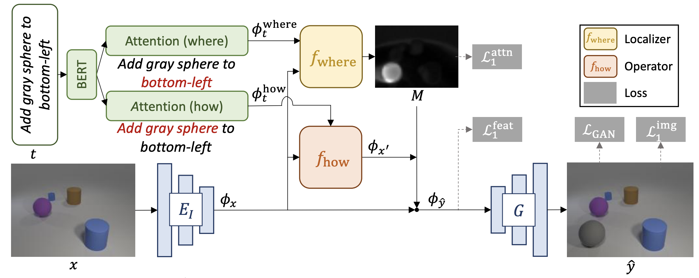

# Text as Neural Operator: Image Manipulation by Text Instruction

This is the code for the paper:

**<a href="about:blank">Text as Neural Operator: Image Manipulation by Text Instruction
</a>**
<br>
Tianhao Zhang, Hung-Yu Tseng, Lu Jiang, Weilong Yang, Honglak Lee, Irfan Essa
<br>


*Please note that this is not an officially supported Google product.* And *this is the reproduced, not the original code.*

If you find this code useful in your research then please cite

```
TODO: Citation
```

## Introduction
In this paper, we study a new task that allows users to edit an input image using
language instructions.


The key idea is to treat language as neural operators to locally modify the image feature.
To this end, our model decomposes the generation process into finding where (spatial region)
and how (text operators) to apply modifications. We show that the proposed model performs
favorably against recent baselines on three datasets.



## Installation

Clone this repo and go to the cloned directory.

Please create a environment using python 3.7 and install dependencies by
```bash
pip install -r requirements.txt
```

To reproduce the results reported in the paper, you would need an V100 GPU.

## Download datasets and pretrained model
The original Clevr dataset we used is from this [external website](https://github.com/google/tirg). The original Abstract Scene we used is from this [external website](https://github.com/Maluuba/GeNeVA_datasets/)
Pretrained models (Clevr and Abstract Scene) can be downloaded
from [here](https://storage.googleapis.com/bryanzhang-bucket/checkpoints.tar). Extract the tar:
```
tar -xvf checkpointss.tar -C ../
```

## Testing Using Pretrained Model

Once the dataset is preprocessed and the pretrained model is downloaded,

1. Generate images using the pretrained model.
    ```bash
    bash run_test.sh
    ```
    Please switch parameters in the script for different datasets. Testing parameters for Clevr and Abstract Scene datasets are already configured in the script.

2. The outputs are at `../output/`.

## Training

New models can be trained with the following commands.

1. Prepare dataset. Processed datasets can be downloaded from the link above.
If you are to use a new dataset, please follow the structure of the provided
datasets, which means you need paired data (input image, input text, output image)

2. Train.

```bash
# Pretraining
bash run_pretrain.sh

# Training
bash run_train.sh
```

There are many options you can specify. Training parameters for Clevr and Abstract Scene datasets are already configured in the script.

Tensorboard logs are stored at `[../checkpoints_local/TIMGAN/tfboard]`.

## Testing

Testing is similar to testing pretrained models.

```bash
bash run_test.sh
```
Testing parameters for Clevr and Abstract Scene datasets are already configured in the script.

## Evaluation

The FID score is computed using the pytorch implementation [here](https://github.com/mseitzer/pytorch-fid).
Image retrieval script will be released soon.

## Pretrained Model Performance

|                | FID  | RS@1     | RS@5     |
|----------------|------|----------|----------|
| Clevr          | 33.0 | 95.9±0.1 | 97.8±0.1 |
| Abstract Scene | 35.1 | 35.4±0.2 | 58.7±0.1 |

## Code Structure

- `run_pretrain.sh`, `run_train.sh`, `run_test.sh`: bash scripts for pretraining, training and testing.
- `train_recon.py`, `train.py`, `test.py`: the entry point for pretraining, training and testing.
- `models/tim_gan.py`: creates the networks, and compute the losses.
- `models/networks.py`: defines the basic modules for the architecture.
- `options/`: options.
- `dataset/`: defines the class for loading the dataset.

## Question
Please contact bryanzhang@google.com if you need the preprocessed data or the Cityscapes pretrained model.
